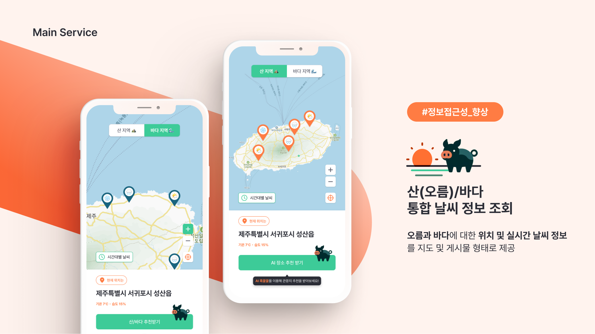
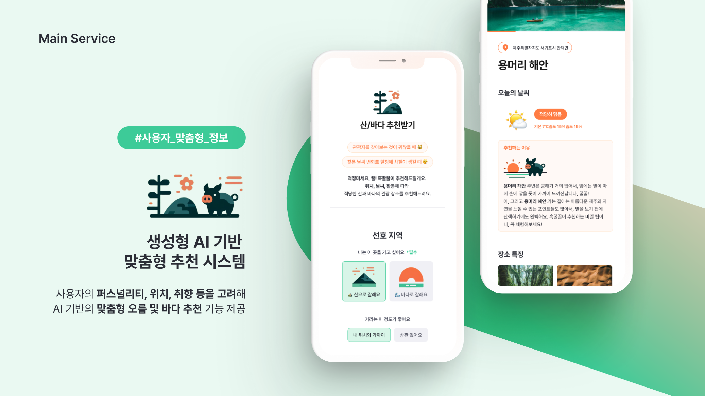

## 🔗 배포 URL
🍊제주해맑음 바로가기🍊 </br>
https://master--jejuitpeople.netlify.app/

<br/>
<br/>

##  목차
1. [프로젝트 소개](#1-프로젝트-소개)
2. [구현 기능](#2-구현-기능)
3. [팀원 소개](#3-팀원-소개)
4. [개발 환경](#4-개발-환경)
5. [팀 협업 방식](#5-팀-협업-방식)
6. [설치 및 로컬 실행방법](#6-설치-및-로컬-실행방법)

<br/>
<br/>


## 1. 프로젝트 소개
### 구름톤(9oormthon) kakao x goorm에서 진행한 3박 4일 해커톤을 통해 만들어진 제주 해맑음입니다.





<br/>
<br/>
<br/>
<br/>

## 2. 구현 기능

| 날씨 정보 조회 | 생성형 AI 맞춤 오름 추천 |AI 기반 리뷰 요약|오름 상세정보 확인 |
|-----------|----------------------------------- | --------------------- | ------------------------------- |
|||| |

<br/>
<br/>
<br/>


## 3. 팀원 소개
| 고동희 | 김민철 | 김혜빈 | 이채영| 조승효 |
| ------------------------------------------------------------------------------------------------------------------------------------------- | ------------------------------------------------------------------------------------------------------------------------------------------- | ------------------------------------------------------------------------------------------------------------------------------------------- | -------------------------------------------------------------------------------------------------------------------------------------------- | -------------------------------------------------------------------------------------- |
| | |  | | |
| [🔗고동희 Github](https://github.com/kodonghee)| [🔗김민철 Github](https://github.com/choriBae)| [🔗김혜빈 Github](https://github.com/khv2644511)| [🔗이채영 Github](https://github.com/lo0obs)| [🔗조승효 Github](https://github.com/Joseunghyo7742) |
| 백엔드 | 기획 | 프론트 | 디자이너  | 프론트|

<br/>
<br/>
<br/>

## 4. 개발 환경


<br/>
<br/>
<br/>

## 5. 팀 협업 방식
- [🔗Notion 링크](https://www.notion.so/9-7be0edcf3b334cab9c1a289d5722ecf1?pvs=4) 
- [🔗JIRA 링크](https://chori0.atlassian.net/jira/software/projects/JEJ/boards/3)
- [🔗Figma 링크](%EC%A0%9C%EC%A3%BC%EC%9E%87%EC%82%AC?type=design&node-id=15761%3A2544&mode=design&t=9QzZ2HM1E3esohNI-1)
- [🔗Fimgam 링크](https://www.figma.com/file/HyjMZuEdaQ9ppOWN6q9U4I/%ED%94%BC%EA%B7%B8%EC%9E%BC?type=whiteboard&t=qST83ywMbh4GJ8JZ-0)

<br/>
<br/>
<br/>

## 6. 설치 및 로컬 실행방법

### 설치법
```sh
npm install
```

### 로컬 실행방법
```sh
npm run start

```

